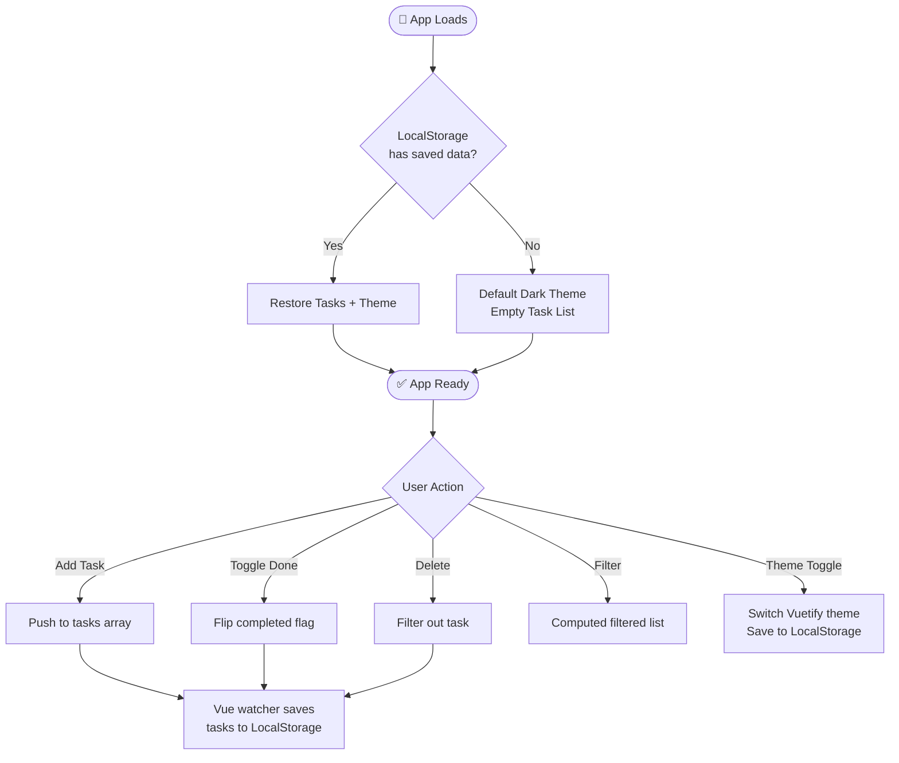

<div align="center">

<br/>


<br/>

<p align="center">
  
  &nbsp;
  
  &nbsp;
  
  &nbsp;
  
</p>

<p align="center">
  
  &nbsp;
  
  &nbsp;
  
</p>

<br/>

> **A premium, luxury-designed To-Do application** built with Vue 3 + Vuetify 4.  
> Featuring a stunning glassmorphic dark UI, smooth micro-animations,  
> full task management, and seamless local storage persistence.

<br/>

---

</div>

## ✨ Features

<table>
<tr>
<td width="50%">

### 🎯 Core Functionality
- ✅ **Add Tasks** — Type and press Enter or click Add
- 🗑️ **Delete Tasks** — One-click removal with animation
- ☑️ **Mark Complete** — Toggle tasks as done / undone
- 🔍 **Filter Tasks** — All · Pending · Completed
- 💾 **Persist Data** — Survives browser refresh via LocalStorage

</td>
<td width="50%">

### 🎨 UI & Design
- 🌑 **Dark Mode** — Obsidian black glassmorphism theme
- ☀️ **Light Mode** — Soft violet/rose premium theme
- 🔄 **Theme Toggle** — Instant switch, preference saved
- 📊 **Progress Tracker** — Live completion stats & gradient bar
- 💫 **Micro-animations** — Smooth transitions on every action

</td>
</tr>
</table>

---

## 🛠️ Tech Stack

| Technology | Version | Role |
|:---:|:---:|:---|
|  | `^3.5` | Reactive UI framework |
|  | `^4.1` | Material Design component library |
|  | `~6.0` | Type-safe JavaScript |
|  | `^8.0` | Lightning-fast build tool |
|  | `^7.4` | Material Design Icons |
|  | — | Outfit & Plus Jakarta Sans |

---

## 🚀 Getting Started

### Prerequisites

Make sure you have **Node.js** `≥ 22.18.0` installed:

```bash
node --version   # v22.x or higher
npm --version    # 10.x or higher
```

### Installation

```bash
# 1. Clone the repository
git clone https://github.com/your-username/todo-app.git
cd todo-app

# 2. Install dependencies
npm install

# 3. Start the development server
npm run dev
```

Then open **http://localhost:5173** in your browser 🎉

### Build for Production

```bash
npm run build     # Compiles & minifies for production
npm run preview   # Preview the production build locally
```

---

## 📁 Project Structure

```
todo-app/
│
├── 📂 src/
│   ├── 📂 components/
│   │   ├── 🧩 TaskInput.vue      # Input bar with glowing Add button
│   │   ├── 🧩 TaskFilter.vue     # Segmented All / Pending / Completed tabs
│   │   ├── 🧩 TaskItem.vue       # Individual task card with animations
│   │   └── 🧩 TaskList.vue       # Animated list with empty state
│   │
│   ├── 📂 plugins/
│   │   └── ⚙️  vuetify.ts        # Dark + Light premium themes
│   │
│   ├── 🎯 App.vue                # Root: theme toggle, stats, layout
│   └── 🚀 main.ts                # Entry point
│
├── 📄 index.html                 # Google Fonts, meta tags
├── ⚙️  vite.config.ts            # Vite configuration
├── 📝 tsconfig.json              # TypeScript configuration
└── 📦 package.json               # Dependencies & scripts
```

---

## 🎨 Design System

### Color Palette

#### 🌑 Dark Theme — Midnight Obsidian
| Token | Value | Preview |
|:---:|:---:|:---:|
| Background | `#090a0f` |  |
| Surface | `#131520` |  |
| Primary | `#8b5cf6` |  |
| Secondary | `#ec4899` |  |
| Success | `#10b981` |  |

#### ☀️ Light Theme — Soft Violet
| Token | Value | Preview |
|:---:|:---:|:---:|
| Background | `#f5f3ff` |  |
| Surface | `#ffffff` |  |
| Primary | `#7c3aed` |  |
| Secondary | `#db2777` |  |
| Success | `#059669` |  |

### Typography

| Font | Usage | Weight |
|:---|:---|:---|
| **Outfit** | App title, stats numbers, headings | 800 |
| **Plus Jakarta Sans** | Body, task titles, UI labels | 400 – 700 |

---

## ⚡ How It Works



---

## 📋 Functional Requirements — Completion Status

| # | Requirement | Status |
|:---:|:---|:---:|
| 1 | **Add Task** — Enter task, click Add, appears in list | ✅ Done |
| 2 | **Delete Task** — Remove any task from the list | ✅ Done |
| 3 | **Mark Completed** — Toggle completed / uncompleted with visual change | ✅ Done |
| 4 | **Filter Tasks** — All, Completed, Pending filters | ✅ Done |
| 5 | **Persist Data** — Tasks survive page refresh via LocalStorage | ✅ Done |
| + | **Theme Toggle** — Dark / Light mode with persisted preference | ✅ Bonus |
| + | **Progress Tracker** — Live completion rate with gradient progress bar | ✅ Bonus |

---

## 🤖 AI Development Process

This project was built in collaboration with **AI tools** as part of an assignment to understand modern AI-assisted development workflows.

### Prompting Strategy Used

1. **Break down the problem** into smaller subtasks (add, delete, complete, filter, persist)
2. **Describe the tech stack explicitly** — Vue 3 + Vuetify 4 + TypeScript
3. **Request premium UI** with specific design language (glassmorphism, obsidian palette)
4. **Iterate with feedback** — fix warnings, add theme toggle, improve persistence
5. **Review & understand** every code block before accepting

### Key Learnings

> - AI tools excel at boilerplate and component scaffolding  
> - Specific prompts yield better, more targeted output  
> - Always review and test AI-generated code — don't blindly copy  
> - AI helps debug issues quickly when you describe the exact error  
> - Understanding the code is the goal, not just shipping it

---

## 📄 License

This project was created as part of an academic assignment.  
Feel free to use it as a reference for learning Vue 3 + Vuetify 4.

---

<div align="center">

<br/>


<br/><br/>


<br/>

</div>
